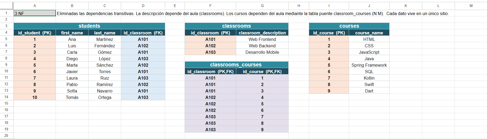
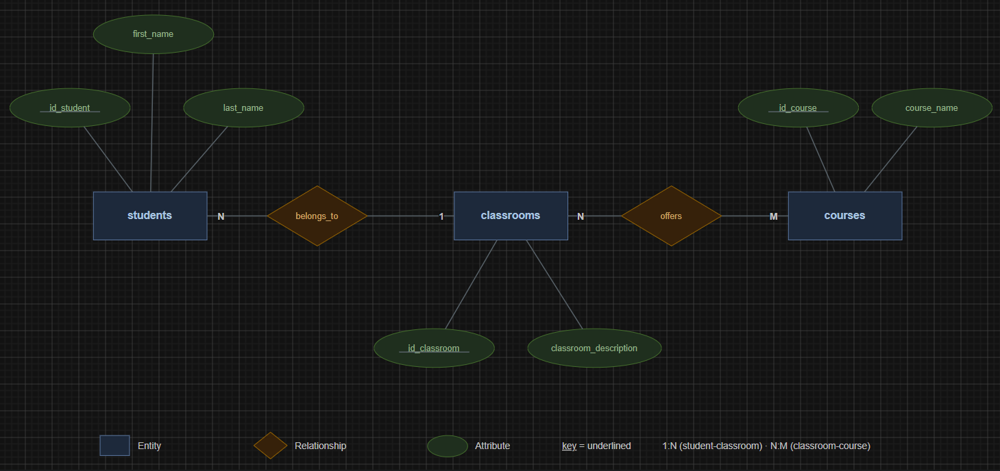
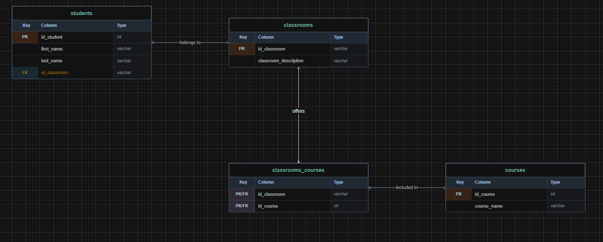
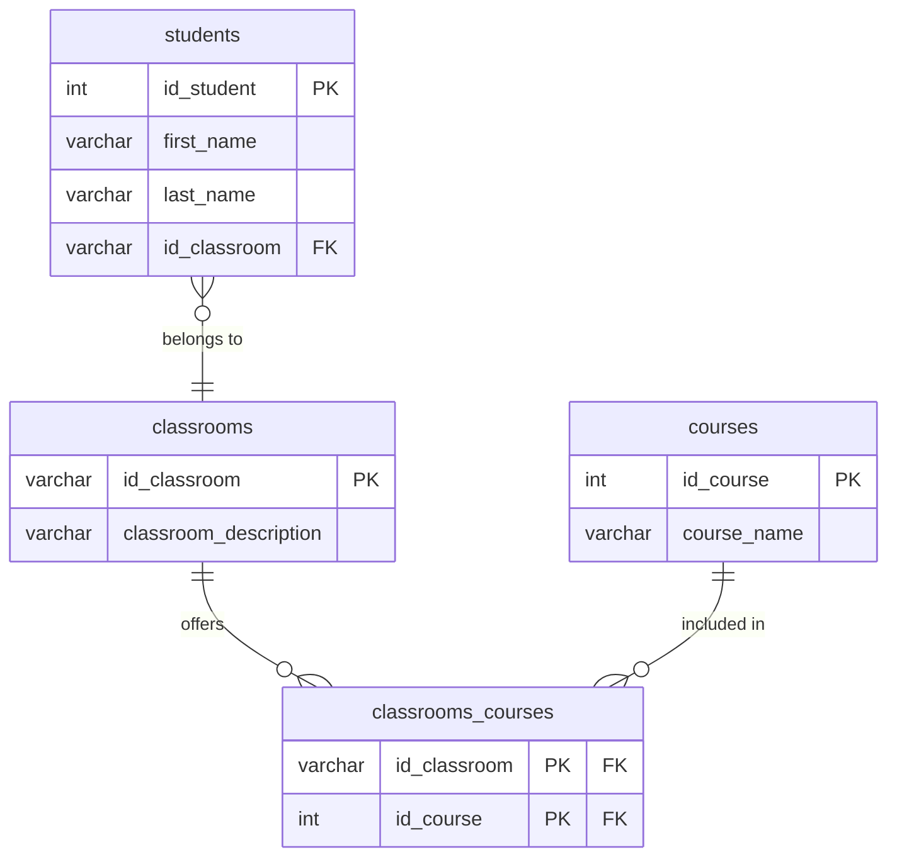

# 🎓 Database Normalization (3FN) – Students, Classrooms & Courses

> Ejercicio de normalización de una base de datos relacional desde una tabla no normalizada hasta la Tercera Forma Normal (3FN).

---

## 📸 Vista previa

A continuación se muestran los principales resultados obtenidos durante el proceso de normalización.

|     Tabla normalizada (3FN)      |    Modelo ER (Chen)     | Modelo Relacional (Crow's Foot) |
| :------------------------------: | :---------------------: | :-----------------------------: |
|  |  |        |

---

## 📑 Índice

- [Descripción](#-descripción)
- [Tabla original](#️-tabla-original)
- [Proceso de normalización](#-proceso-de-normalización)
- [Modelo final](#-modelo-final)
- [Relaciones](#-relaciones-del-modelo)
- [Claves primarias y foráneas](#-claves-primarias-y-foráneas)
- [Diagrama ER](#-diagrama-entidad-relación-modelo-de-chen)
- [Diagrama Crow's Foot](#-diagrama-de-esquema-de-base-de-datos-patas-de-gallo--crows-foot)
- [Estructura del repositorio](#-estructura-del-repositorio)
- [Tecnologías](#️-tecnologías)
- [Recursos](#-recursos)
- [Autora](#-autora)

---

## 📋 Descripción

El objetivo de este proyecto es aplicar las tres primeras formas normales (1FN, 2FN y 3FN) a una tabla sin normalizar, eliminando redundancias, dependencias incorrectas y grupos de repetición para obtener un modelo relacional consistente.

Los requisitos principales son:

1. **Normalizar la tabla proporcionada** (hasta la 3FN).
2. **Realizar un diagrama ER de Chen** para modelar conceptualmente las entidades y sus relaciones.
3. **Realizar un diagrama UML (Patas de gallo / Crow's Foot)** para representar el esquema físico de la base de datos con sus tablas, campos y claves.

---

## 🗂️ Tabla original

Partimos de esta tabla que nos indica en el enunciado: _Los lenguajes de programación dependen del aula_

| id_student |  name_student  | classroom | classroom_description | course1 |     course2      |  course3   |
| :--------: | :------------: | :-------: | :-------------------: | :-----: | :--------------: | :--------: |
|     1      |  Ana Martínez  |   A101    |     Web Frontend      |  HTML   |       CSS        | JavaScript |
|     2      | Luis Fernández |   A102    |      Web Backend      |  Java   | Spring Framework |    SQL     |
|     3      |  Carla Gómez   |   A101    |     Web Frontend      |  HTML   |       CSS        | JavaScript |
|     4      |  Diego López   |   A103    |   Desarrollo Mobile   | Kotlin  |      Swift       |    Dart    |
|     5      | Marta Sánchez  |   A102    |      Web Backend      |  Java   | Spring Framework |    SQL     |
|     6      | Javier Torres  |   A101    |     Web Frontend      |  HTML   |       CSS        | JavaScript |
|     7      |   Laura Ruiz   |   A103    |   Desarrollo Mobile   | Kotlin  |      Swift       |    Dart    |
|     8      | Pablo Ramírez  |   A102    |      Web Backend      |  Java   | Spring Framework |    SQL     |
|     9      | Sofía Navarro  |   A101    |     Web Frontend      |  HTML   |       CSS        | JavaScript |
|     10     |  Tomás Ortega  |   A103    |   Desarrollo Mobile   | Kotlin  |      Swift       |    Dart    |

---

## 🔄 Proceso de normalización

Antes de comenzar el proceso de normalización, se identificaron los siguientes problemas en la tabla original (`sin_normalizar`):

- **Atributos compuestos:** El campo `name_student` contenía el nombre y el apellido juntos en un solo campo (por ejemplo: _"Ana Martínez"_, _"Luis Fernández"_).
- **Dependencias transitivas:** La descripción del aula (`classroom_description`, como _"Web Frontend"_ o _"Web Backend"_) no dependía de la clave primaria del estudiante, sino del código de la clase (`classroom`), repitiéndose de forma redundante e innecesaria para cada estudiante.
- **Grupos de repetición:** Existían tres columnas estáticas (`course1`, `course2`, `course3`) para almacenar los cursos de cada estudiante. Esto provocaba rigidez en el diseño, celdas vacías en caso de menos cursos y dificultades para realizar consultas eficientes, violando directamente la Primera Forma Normal (1FN).

### Solución Aplicada

**1FN (Primera Forma Normal)** — Se eliminaron los atributos compuestos dividiendo `name_student` en dos campos atómicos e independientes (`first_name` y `last_name`). Asimismo, para eliminar los grupos de repetición de los cursos (`course1`, `course2`, `course3`), se reestructuró la información de manera que cada curso se convierta en un registro independiente asociado, preparando el terreno para crear la entidad de cursos de forma atómica.

**2FN (Segunda Forma Normal)** — Tras aplicar la 1FN, se separaron las dependencias funcionales de los datos. Dado que los cursos y las aulas poseen dinámicas independientes de la identidad del estudiante, se aislaron las entidades para garantizar que todas las tablas resultantes posean claves primarias simples o compuestas en las que los atributos no clave dependan de la clave completa.

**3FN (Tercera Forma Normal)** — Se eliminó la dependencia transitiva existente trasladando de forma definitiva la relación entre el código del aula y su descripción a una entidad aislada llamada `classrooms`. Con esto se evita la duplicidad masiva de cadenas de texto y redundancia de datos en la tabla de alumnos, garantizando que cada atributo no clave dependa única y exclusivamente de la clave primaria.

> 📄 **Normalización paso a paso (1FN → 2FN → 3FN):**
> [Ver online en Google Sheets](https://docs.google.com/spreadsheets/d/1CXWS7D80rAA8V16_Yx3W6oa7oPQObVGM/edit?usp=sharing) · [Descargar .xlsx](docs/database-normalization.xlsx)

---

## 🧩 Modelo final

El resultado del proceso de normalización es un modelo relacional compuesto por tres entidades principales y una tabla intermedia de unión para resolver la relación de muchos a muchos (N:M).

1. **`students`**: Almacena la información única e individual de cada estudiante.
   - `id_student` (PK)
   - `first_name`
   - `last_name`
   - `id_classroom` (FK)

2. **`classrooms`**: Almacena de forma unificada el catálogo de aulas y su especialidad.
   - `id_classroom` (PK) _(procedente de la columna original `classroom`)_
   - `classroom_description`

3. **`courses`**: Almacena el catálogo de cursos disponibles.
   - `id_course` (PK)
   - `course_name` _(mapea de manera unificada los valores HTML, CSS, JavaScript, Java, Spring Framework, SQL, Kotlin, Swift, Dart)_

4. **`classrooms_courses`**: Tabla de unión (relación puente N:M) necesaria para vincular dinámicamente qué asignaturas se imparten en qué aulas, evitando las columnas repetitivas horizontales del modelo original.
   - `id_classroom` (PK, FK)
   - `id_course` (PK, FK)

## 🔗 Relaciones del modelo

Una vez normalizada la base de datos, las relaciones entre las entidades quedan definidas de la siguiente forma:

- Un **aula** puede tener **muchos estudiantes** (1:N).
- Un **aula** puede impartir **muchos cursos** (N:M).
- Un **curso** puede impartirse en **varias aulas** (N:M).
- La relación muchos a muchos entre aulas y cursos se resuelve mediante la tabla de unión `classrooms_courses`.

---

## 🔑 Claves primarias y foráneas

| Tabla                | Clave primaria              | Clave(s) foránea(s) |
| -------------------- | --------------------------- | ------------------- |
| `students`           | `id_student`                | `id_classroom`      |
| `classrooms`         | `id_classroom`              | —                   |
| `courses`            | `id_course`                 | —                   |
| `classrooms_courses` | `id_classroom`, `id_course` | Ambas               |

---

## 📐 Diagrama Entidad-Relación (Modelo de Chen)

Representa el modelo conceptual, mostrando las entidades principales y cómo se relacionan entre sí. La clave foránea `id_classroom` y la tabla puente `classrooms_courses` no aparecen como columnas ni tablas: se expresan mediante las relaciones (`belongs_to` y `offers`).


---

## 🦶 Diagrama de Esquema de Base de Datos (Patas de Gallo / Crow's Foot)

Representa el esquema físico de la base de datos con las cuatro tablas, sus campos, claves y relaciones. La relación N:M aula–curso se resuelve a través de la tabla de unión `classrooms_courses`.


Versión Mermaid del mismo diagrama:



---

## 📁 Estructura del repositorio

```text
database-normalization/
├── diagrams/
│   ├── chen-er.drawio
│   └── crowsfoot.drawio
├── docs/
│   └── database-normalization.xlsx
├── images/
│   ├── normalized-table.png
│   ├── chen-er.png
│   └── crowsfoot.png
├── README.md
└── .gitignore
```

---

## 🛠️ Tecnologías

- **[Google Sheets](https://workspace.google.com/products/sheets/)** — Utilizado para la normalización de la tabla paso a paso (1FN → 2FN → 3FN) 👉 [Ver hoja](https://docs.google.com/spreadsheets/d/1CXWS7D80rAA8V16_Yx3W6oa7oPQObVGM/edit?usp=sharing)
- **[diagrams.net (draw.io)](https://www.diagrams.net/)** — Creación del diagrama Entidad-Relación (Modelo Chen) y del diagrama en notación de patas de gallo (Crow's Foot)
- **[Mermaid](https://mermaid.js.org/)** — Generación de la versión del diagrama ER
- **[Visual Studio Code](https://code.visualstudio.com/)** — Editor de código empleado para redactar la documentación, editar archivos Markdown y gestionar el proyecto
- **[Markdown](https://www.markdownguide.org/)** — Lenguaje de marcado ligero utilizado para la documentación y la elaboración del README
- **[Git](https://git-scm.com/)** / **[GitHub](https://github.com/)** — Sistema de control de versiones y plataforma para el alojamiento del proyecto

---

## 📚 Recursos

- **[diagrams.net](https://app.diagrams.net/)** — Herramienta gratuita para crear diagramas de flujo, UML, ERD y otros esquemas visuales
- **[Normalización de Bases de Datos (freeCodeCamp)](https://www.freecodecamp.org/news/database-normalization-1nf-2nf-3nf-table-examples/)** — Explicación clara de la Primera, Segunda y Tercera Forma Normal (1NF, 2NF y 3NF) con ejemplos prácticos
- **[Cómo crear un diagrama de base de datos](https://www.lucidchart.com/pages/es/tutorial-de-diagrama-entidad-relacion)** — Guía paso a paso para diseñar diagramas Entidad-Relación (ERD) y modelar bases de datos
- **[Mermaid - Entity Relationship Diagrams](https://mermaid.js.org/syntax/entityRelationshipDiagram.html)** — Documentación oficial de Mermaid para crear diagramas Entidad-Relación directamente desde texto mediante sintaxis Markdown

---

## 👩‍💻 Autora

**[Jenny Sánchez Requejo](https://github.com/Jennydev-25)**
